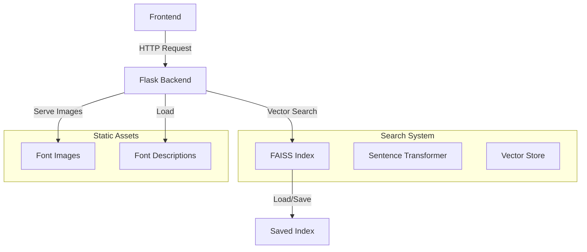
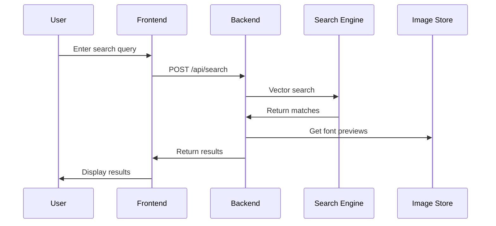
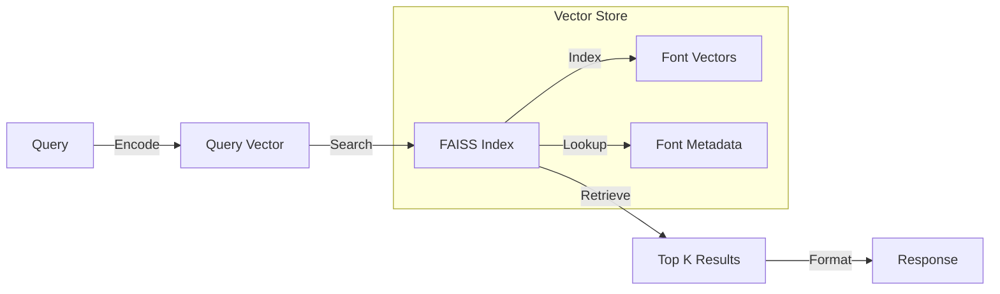

# Font Search System 🔍

A semantic font search system that uses natural language processing and vector embeddings to find fonts based on descriptions, characteristics, and use cases.

## 🌟 Features

- Natural language font search
- Semantic understanding of font characteristics
- Vector-based similarity matching
- Real-time preview of fonts
- Dynamic card-based results interface
- Persistent search index
- RESTful API interface

## 🏗 Architecture



## 📁 Project Structure

```
fontsearch/
├── frontend/                 # Frontend files
│   ├── index.html           # Main search interface
│   └── index_old.html       # Previous version
├── font_descriptions/       # Font JSON metadata
├── rendered_fonts/         # Font preview images
├── serving_index/         # Search index files
├── app.py                # Flask application
├── vector_font_search.py # Vector search implementation
├── indexer.ipynb        # Index building notebook
└── sandbox.ipynb       # Development sandbox
```

## 🔄 Search Flow



## 🚀 Getting Started

1. Clone the repository:
```bash
git clone https://github.com/yourusername/fontsearch.git
cd fontsearch
```

2. Install dependencies:
```bash
pip install -r requirements.txt
```

3. Build the search index:
```bash
python -c "from vector_font_search import VectorFontSearch; \
           search = VectorFontSearch(images_dir='rendered_fonts'); \
           search.build_index('font_descriptions')"
```

4. Start the Flask server:
```bash
python app.py
```

5. Open `frontend/index.html` in your browser

## 💻 API Reference

### Search Endpoint
```http
POST /api/search
Content-Type: application/json

{
    "query": "fonts that are usually used in memes and trolling"
}
```

### Response Format
```json
[
    {
        "filename": "font_name.png",
        "description": "Font description...",
        "technical_characteristics": ["Bold", "Sans-serif"],
        "personality_traits": ["Modern", "Clean"],
        "practical_contexts": ["Headlines", "UI"],
        "score": 0.85,
        "image": "/fonts/font_name.png"
    }
]
```

## 🔍 Search Engine Architecture



## 🛠 Technical Components

### Vector Search
- Uses Sentence Transformers for text embedding
- FAISS for efficient similarity search
- Inner product similarity metric
- Automatic index persistence

### Frontend
- Pure HTML/JS implementation
- Tailwind CSS for styling
- Dynamic card layout
- Responsive design
- Real-time search

### Backend
- Flask REST API
- Static file serving
- CORS support
- Error handling
- JSON response formatting

## 🎨 Font Description Format

```json
{
    "filename": "font_name.png",
    "status": "success",
    "description": {
        "detailed_description": "...",
        "technical_characteristics": [],
        "personality_traits": [],
        "practical_contexts": [],
        "cultural_intuition": [],
        "search_keywords": []
    }
}
```

## 🔧 Configuration

Key configuration options are available in the `vector_font_search.py`:

```python
EMBEDDING_MODEL = 'all-MiniLM-L6-v2'  # Sentence transformer model
INDEX_TYPE = 'FlatIP'                # FAISS index type
NORMALIZE_VECTORS = True             # L2 normalization
```

## 📈 Performance

The system uses:
- FAISS for efficient similarity search
- Batched processing for embeddings
- Caching of computed vectors
- Persistent index storage

## 🤝 Contributing

1. Fork the repository
2. Create your feature branch
3. Commit your changes
4. Push to the branch
5. Open a Pull Request

## 📄 License

This project is licensed under the MIT License - see the LICENSE file for details.