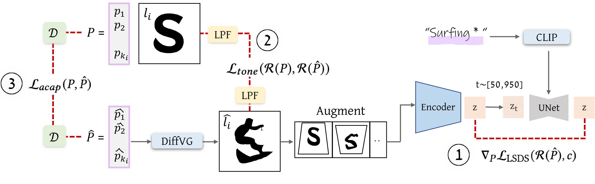

# Project Results Documentation

## Video Output

📹 [Project Demo Video](./assets/all3.mp4)

## SVG Visualizations

1. **Results Summary**  
   

2. **Multiligual Support**  
   

3. **Stable Diffusion post processing**
   
  
   

4. Model Arch
   

   Given an input letter represented by a set of control points 𝑃, and a concept (shown in purple), our goal is to optimize its parameters to reflect the meaning of the word, while still preserving its original style and design. we optimize the new positions 𝑃ˆ of the deformed letter iteratively. At each iteration, we use a differentiable rasterizer (DiffVG marked in blue) that allows to backpropagate gradients from a raster-based loss to the shape’s parameters. We then augmented the rasterized deformed letter and passed into a pretrained frozen Stable Diffusion model, that drives the letter shape to convey the semantic concept using the Lsds loss (1). To preserve the shape of the original letter and ensure legibility of the word, we utilize two additional loss functions. The first loss preserves the local tone and structure of the letter by comparing the low-pass filter (LPF marked in yellow) of the resulting rasterized letter to the original one to compute L𝑡𝑜𝑛𝑒 (2). The second loss regulates the shape modification by constraining the deformation to be as-conformal-as-possible over a triangulation of the letter’s shape (D marked in green), defining L𝑎𝑐𝑎𝑝 (3).